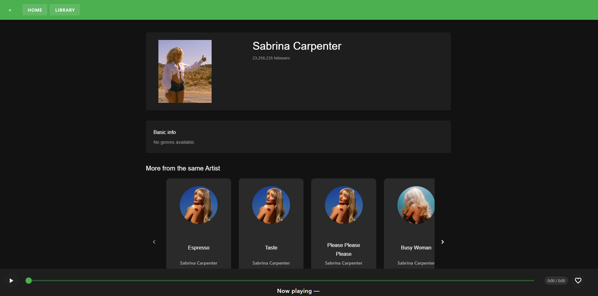
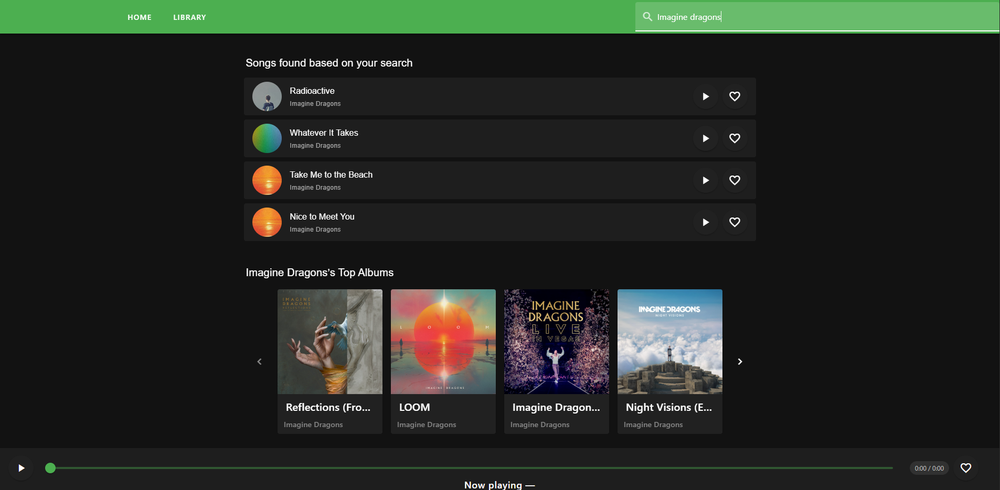
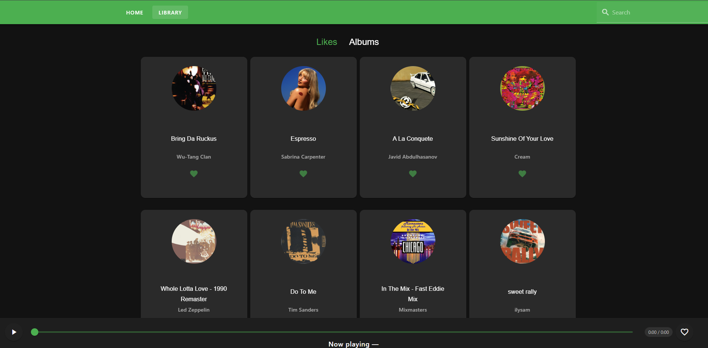
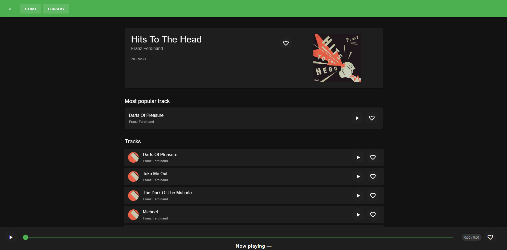

# Web player (TypeScript + Vue + Vuetify)
Web-player application built for my EBC-WAF - Web Applications: Frontend course

## What i learned
- How to build a web application using Vue 3, TypeScript, REST API
- Adopted the Composition API and Pinia for state management
- Integrated the Spotify Web API
- Implemented authentication and token refresh logic for secure API access
- Used Vuetify for UI components
- E2E tests to ensure the main user flow

# Screenshots

#

#

#

